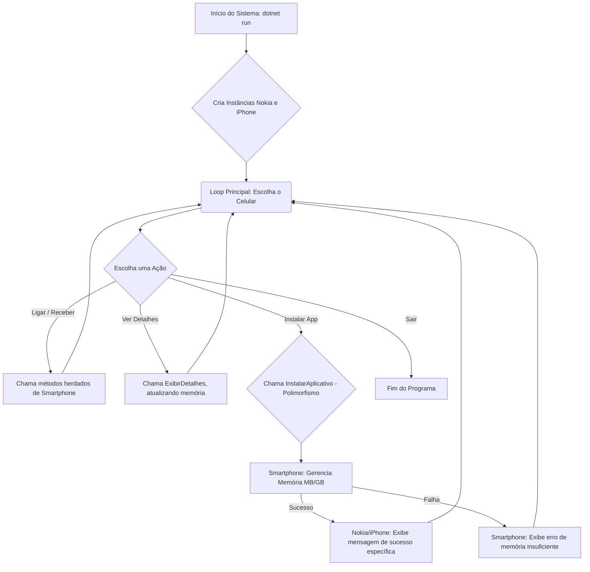

# CELLSTORE

## Badges:


##

### **Índice**

### 📝 **Descrição do Projeto**

Você é responsável por modelar um sistema que trabalha com celulares. Para isso, foi solicitado que você faça uma abstração de um celular e disponibilize maneiras de diferentes marcas e modelos terem seu próprio comportamento, possibilitando um maior reuso de código e usando a orientação a objetos.

#### ⚙️ **Tecnologias Utilizadas**
* **C#** (Linguagem de Programação)
* **.NET 9.0** (Framework)
* **Programação Orientada a Objetos (POO)**: Abstração, Herança e Polimorfismo.

#### 📁 **Estrutura do Projeto**

```
├── .gitignore
├── DesafioPOO.csproj
├── Imagens
└── diagrama.png
├── Models
├── Iphone.cs
├── Nokia.cs
└── Smartphone.cs
├── Program.cs
└── README.md
```
#### ** Fluxo de Funcionamento**

---

### 🚀 **Funcionalidades e Demonstração**
#### **Principais Funcionalidades**

**Abstração do Celular:** Classe base Smartphone que define as características (Modelo, IMEI, Memoria) e ações básicas (Ligar, Receber Ligação).

**Herança e Reuso:** Classes Nokia e Iphone utilizam a lógica centralizada de gerenciamento de memória da classe pai.

**Polimorfismo:** O método InstalarAplicativo é sobrescrito para simular o processo de instalação de cada marca (Ovi Store vs. App Store).

**Simulação de Memória:** Controle interno da memória em MB, com exibição padronizada em GB (MB), que reflete o uso após cada instalação.

#### **Como funciona**
O programa inicia um loop de menu, permitindo ao usuário escolher entre as marcas e ações. As chamadas de métodos são dinâmicas, garantindo que o comportamento polimórfico (instalação) e o estado do objeto (memória livre) sejam atualizados e refletidos em tempo real.

---

### 💻 **Como Usar a Aplicação**
1.  Certifique-se de ter o **SDK do .NET 9.0** ou superior instalado.
2.  Navegue até o diretório `DesafioPOO` no terminal.
3.  Execute o comando para compilar e rodar o projeto:
    ```bash
    dotnet run
    ```

---

### 👥 **Equipe do Projeto**
<a href="https://github.com/amaro-netto" title="Amaro Netto"></a>
---

### ✅ **Conclusão**
O projeto demonstra o uso dos pilares da Programação Orientada a Objetos em C#, criando um sistema funcional de modelagem de celulares.

---

### 📸 **Prévia do Projeto**
